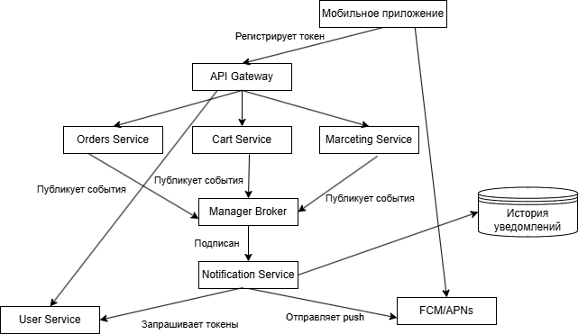

# Архитектура push-уведомлений

## Назначение
Реализовать отправку push-уведомлений в мобильном приложении «Петрушка Зеленая» (брошенная корзина, отмена заказа, рекламные рассылки и другие типы). Бэкенд построен по микросервисной архитектуре.

## Верхнеуровневая схема

## Компоненты системы

### 1. Мобильное приложение
- Получает push-токен от платформенного провайдера (FCM для Android, APNs для iOS).
- Передаёт токен и идентификатор устройства на бэкенд: `POST /api/v1/devices`.
- При получении push-уведомления отображает его в шторке, а при нажатии обрабатывает deep-link, заложенный в payload.

### 2. API Gateway / BFF
Единая точка входа для мобильного клиента. Маршрутизирует запросы к соответствующим микросервисам, включая регистрацию токенов.

### 3. Сервис пользователей и устройств (User Service)
Хранит соответствие `user_id → device_token → platform (iOS/Android)`. Предоставляет API для добавления, удаления и получения токенов. При получении от провайдера кода `NotRegistered` или `InvalidRegistration` удаляет токен.

### 4. Бизнес-сервисы (Orders, Cart, Marketing и др.)
Генерируют события, инициирующие отправку уведомлений:
- `OrderCancelled`, `OrderStatusChanged` — транзакционные;
- `CartAbandoned` — триггерное (отложенное);
- `PromoCampaignStarted` — маркетинговое.

### 5. Сервис уведомлений (Notification Service)
Центральный сервис, отвечающий за:
- приём запросов на отправку (из шины сообщений и от административной панели);
- формирование контента на основе шаблонов (заголовок, текст, изображение, deep-link);
- получение списка токенов получателей через User Service;
- отправку push-сообщений в FCM/APNs;
- обработку ответов: повторные попытки для временных ошибок, удаление недействительных токенов;
- сохранение истории отправок.

### 6. Брокер сообщений (Kafka / RabbitMQ)
Обеспечивает асинхронную связь между бизнес-сервисами и сервисом уведомлений. События публикуются в топики, сервис уведомлений подписывается на них и обрабатывает независимо от источника.

### 7. Внешние провайдеры push-уведомлений
- Firebase Cloud Messaging (FCM) — для Android.
- Apple Push Notification service (APNs) — для iOS.
Возвращают статус доставки и коды ошибок.

## Процесс отправки (на примере отмены заказа)

1. **Регистрация токена** — клиент передаёт токен, User Service сохраняет связь.
2. **Бизнес-событие** — сервис заказов публикует событие `OrderCancelled { order_id, user_id }` в шину.
3. **Обработка события** — Notification Service получает событие, запрашивает все активные токены пользователя в User Service.
4. **Формирование сообщения** — подбирается шаблон «Заказ отменён», в него подставляются переменные.
5. **Отправка** — запрос к FCM/APNs для каждого токена (или мультикаст).
6. **Обработка результата** — успех фиксируется в истории; ошибки `NotRegistered`/`InvalidRegistration` ведут к удалению токена; временные ошибки повторяются с экспоненциальной задержкой.
7. **Реакция на клик** — deep-link в payload открывает в приложении детали заказа.

## Особенности для разных типов уведомлений
- **Транзакционные** — отправляются немедленно при возникновении события.
- **Триггерные (брошенная корзина)** — инициируются периодической задачей в Cart Service, которая выявляет корзины без действий дольше заданного времени.
- **Маркетинговые** — создаются через административный интерфейс с выбором сегмента и контента. Запрос на массовую отправку поступает в Notification Service.

## Детали, требующие внимания
- **Срок жизни токенов** — необходимо регулярно удалять недействительные токены для снижения количества ошибок.
- **Сертификаты APNs** — имеют ограниченный срок действия; нужно предусмотреть мониторинг и своевременное обновление.
- **Ограничения FCM** — изображения в уведомлениях не должны превышать 1 МБ.
- **Отказ от рекламных уведомлений** — в профиле пользователя рекомендуется предусмотреть настройку согласия на получение промо-пушей.

## Возможные направления развития (для обсуждения)
- A/B-тестирование контента и времени отправки.
- Локализация уведомлений.
- Сбор и анализ метрик открытий и конверсий.
- Использование «тихих» пушей для фоновых задач (синхронизация данных).
- Персонализация на основе ML-моделей рекомендаций.

